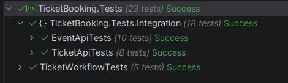
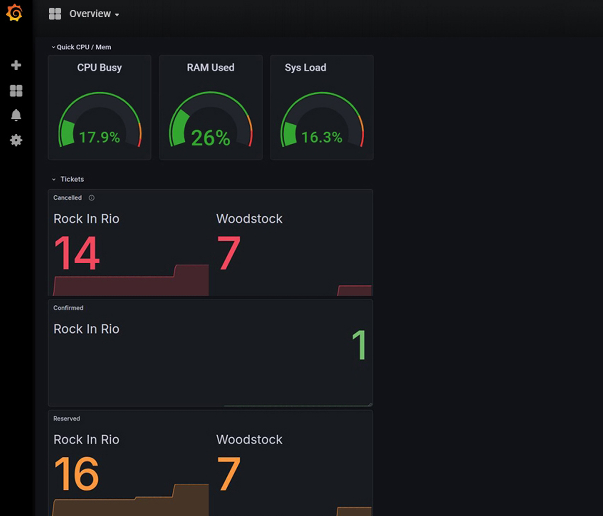
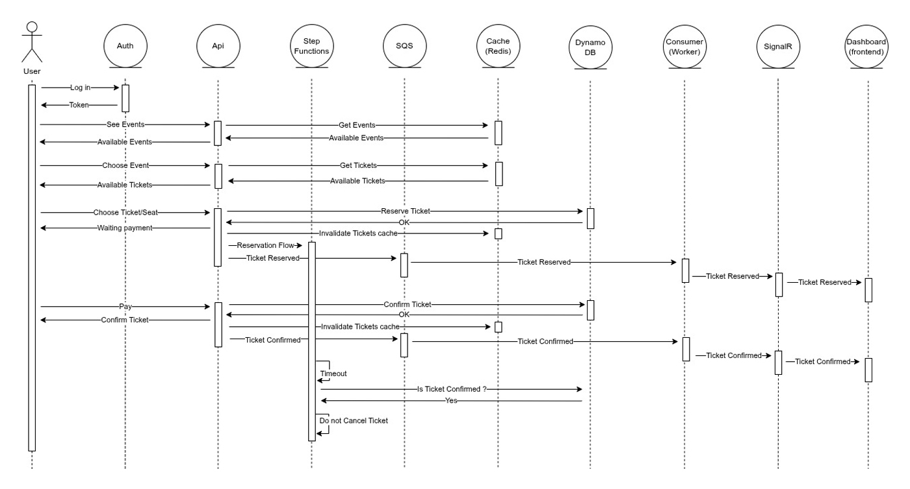

# 🎟️ Acme Tickets: High-Performance Distributed Event System
A robust, enterprise-grade event booking platform built with .NET 9, Clean Architecture and Microservices, showcasing a modern cloud-native approach using AWS services and an advanced Observability stack.

<p align="center">
  
</p>
<br>
<p align="center">
   &emsp;
   &emsp;
</p>
<br>
<p align="center">
  
</p>
<br><br>

## 🚀 Key Features
- Real-time Updates: Low-latency UI synchronization using SignalR/WebSockets.
- Distributed Resilience: Asynchronous processing with AWS SQS and Step Functions.
- Secure by Design: Identity management via Keycloak (OIDC/OAuth2).
- Full Observability: End-to-end tracing and monitoring with the LGTM Stack and .NET Aspire.

<br>

## 🏗️ Architecture & Patterns
This project is built on the pillars of Domain-Driven Design (DDD) and SOLID principles, ensuring a decoupled and testable codebase.

- Clean Architecture: Strict separation of concerns (Domain, Application, Infrastructure, and API).
- Result & Config Patterns: Robust error handling and strongly-typed configurations.
- BFF (Backend for Frontend): Optimized communication for the Blazor frontend.
- Caching Strategy: High-speed data retrieval using Redis.

<br>

## 🛠️ Tech Stack
### Backend & Cloud
- .NET 9 / C#
- Database: DynamoDB (NoSQL)
- Messaging: AWS SQS & Service Bus
- Orchestration: AWS Step Functions
- Auth: Keycloak (OpenID Connect)
- Dev Ecosystem: LocalStack (AWS Emulation for dev/test)

### Frontend
- Blazor (Server/WASM)
- SignalR for real-time seat availability updates.

### Observability & Monitoring
- .NET Aspire Dashboard (Local orchestration)
- OpenTelemetry (Instrumentation)
- Jaeger (Distributed Tracing)
- Grafana, Loki, Prometheus (Metrics & Logs)

<br>

## 🧪 Testing Strategy
Quality is non-negotiable. The project maintains high coverage across:
- Unit Tests: Business logic and Domain invariants (xUnit/FluentAssertions).
- Integration Tests: API endpoints and Database interactions (Testcontainers/LocalStack).
- Architecture Tests: Ensuring dependency rules are never violated.

<br>

## 💻 Local Development
This project is fully containerized and ready for local execution via Docker Compose or .NET Aspire.

```Bash
# Clone the repo
git clone git@github.com:rafaelrgi/TicketBooking.git

# Start Infrastructure (Includes LocalStack, Keycloak, Redis, and LGTM) 
docker-compose up -d 

# Start the backend (Api)
dotnet run --project src/TicketBooking.Api/TicketBooking.Api.csproj --launch-profile http

# Start the frontend
dotnet run --project src/TicketBooking.Admin/TicketBooking.Admin.csproj

```

<br>

## 📈 Observability Insights
The system is instrumented with OpenTelemetry, providing deep insights into:
- Traces: Visualizing the path of a request from Blazor through Microservices to DynamoDB.
- Metrics: Monitoring system health and request throughput.
- Logs: Structured logging aggregated in Grafana Loki.